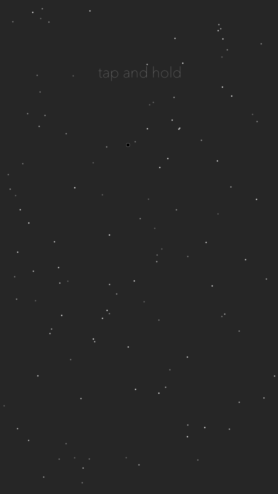
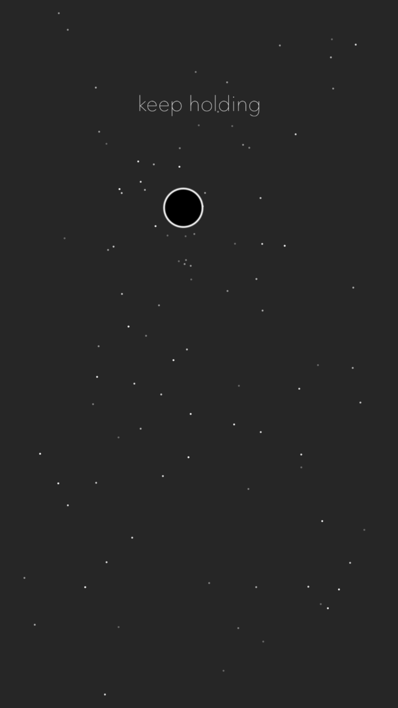
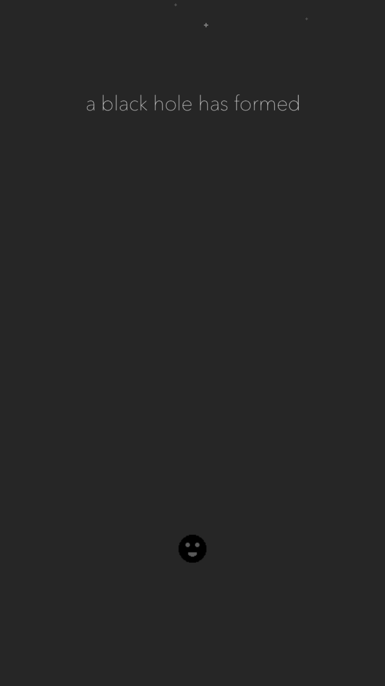
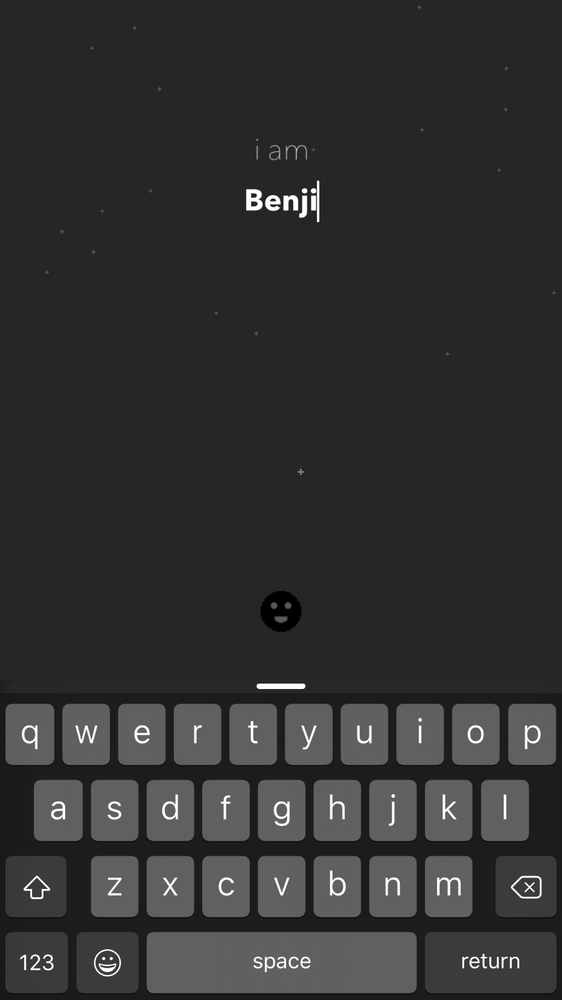
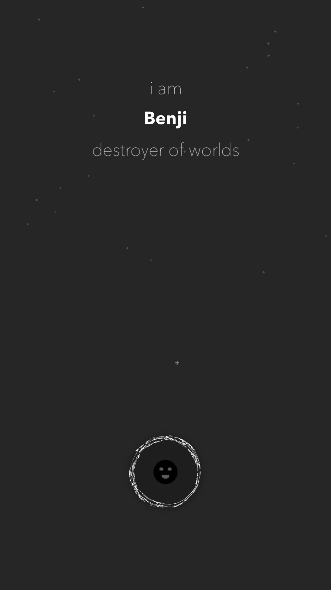
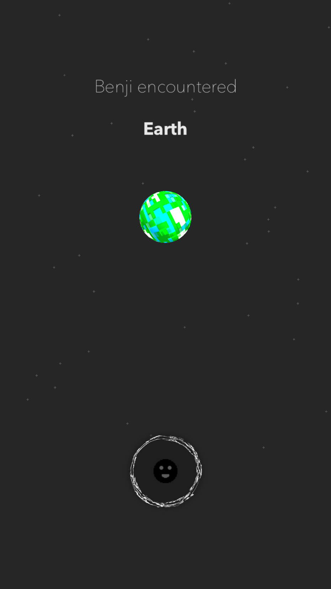
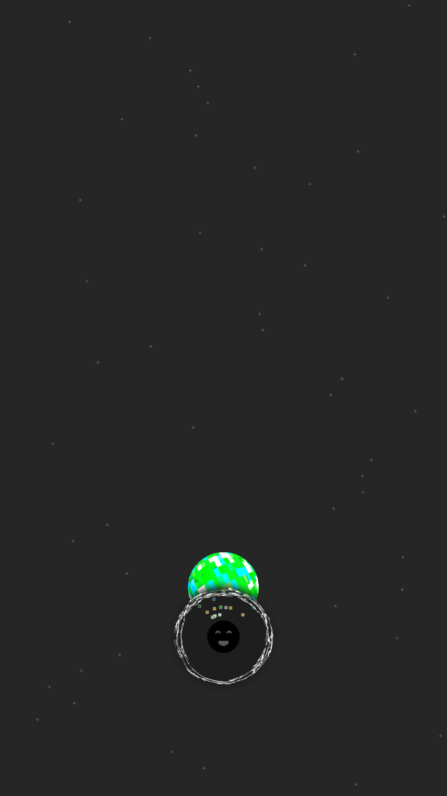
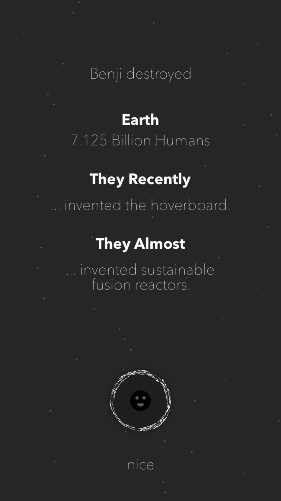

# #000

An experimental app. Uses SceneKit and a Perlin Noise generator to build 3d planets, then projects them into a SpriteKit scene for 2d interactions.

You follow your baby black hole as it goes around destroying planets and whatnot, it's really fun like that. There's no real purpose (yet?).

To reset the app, shake the simulator (or your device).

